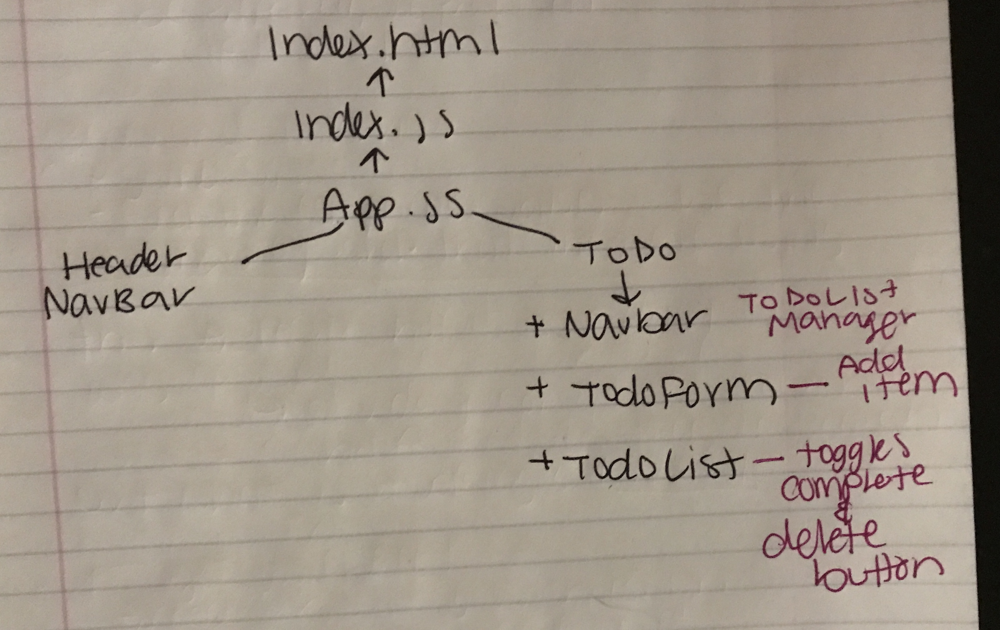

# todo

## About

An application that allows you to create a To Do checklist. You can add items to the list, cross off items, and delete items.

## Author

Simone Odegard

## Repo Name

todo

## Branch Name(s)

hooks

## Deployed site

[netlify](https://wonderful-hamilton-11871e.netlify.app/)

## Pull Requests

- [PR 1](https://github.com/SimoneOdegard/todo/pull/1)

## UML

